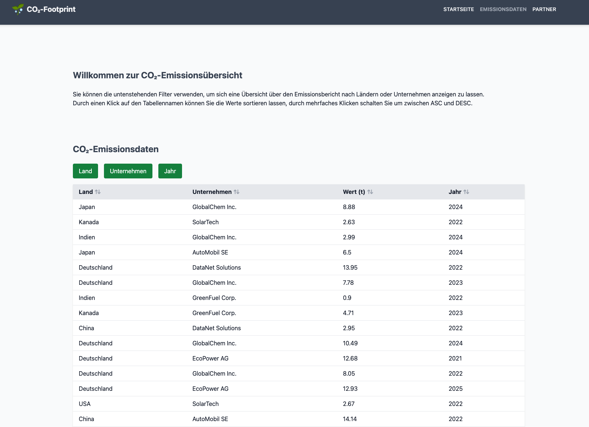
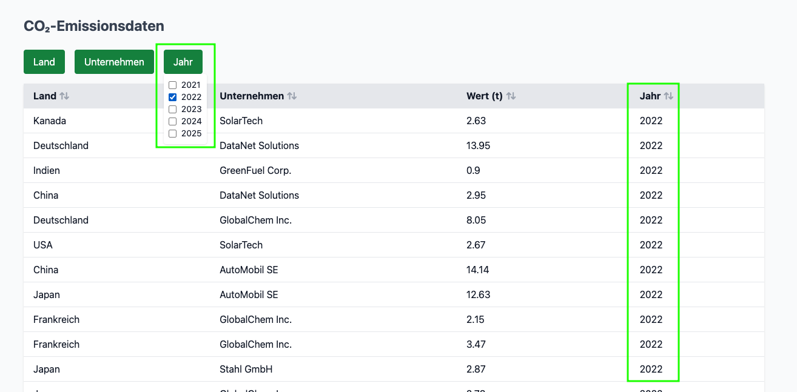
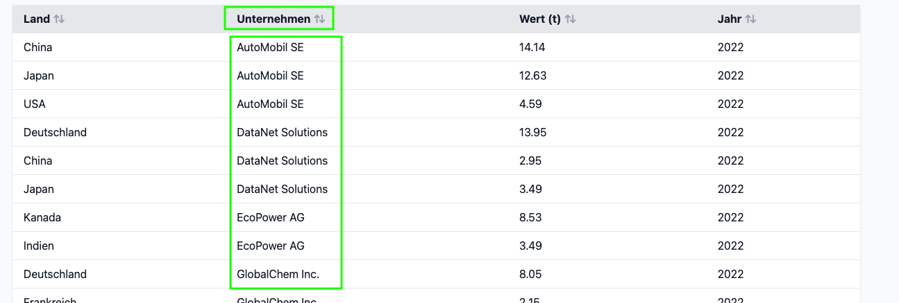
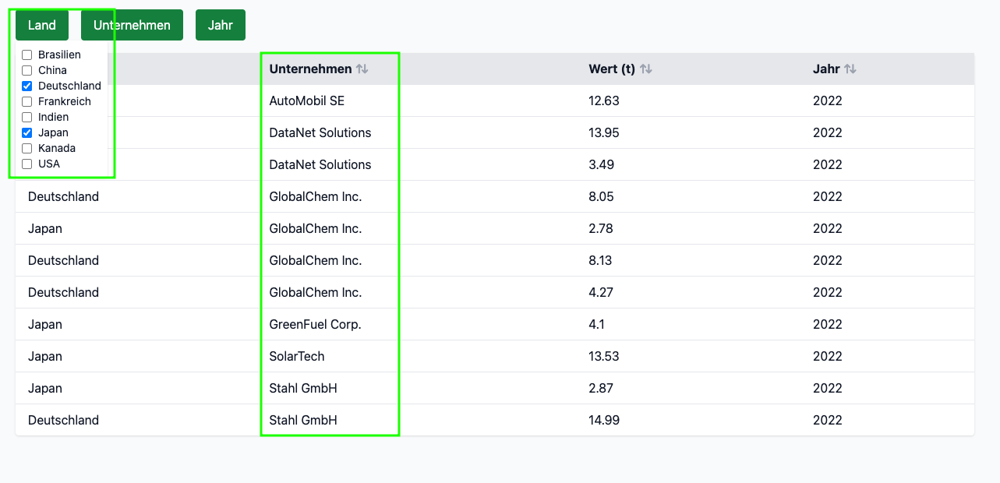
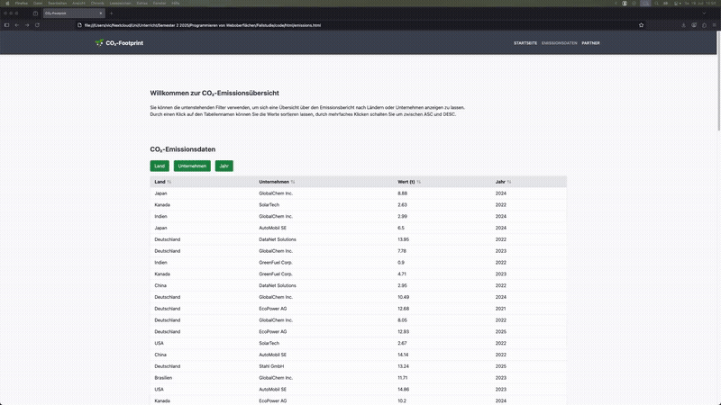

# CO2-Footprint Aufgabe 1 IU Fallstudie
## Einleitung
Das ist eine Anwendung, die eine fiktive Firma repräsentieren soll, die Emissionsdaten öffentlich zur Verfügung stellt.
Die Anwendung lädt eine lokale JSON die **fiktive** Daten zu Emissionen enthält und diese präsentiert.  

## Anleitung
Die Webseite enthält Filter- und Sortierfunktionen, diese sind über der Tabelle mit den Emissiondaten zu finden.
Die Filter bestehen aus Checkboxen, die automatisch anhand des Inhalts der JSON erstellt werden. Klicke einfach auf einen Filter
und wähle, nach was du filtern möchtest.
### Beispiel filtern nach Jahr
Du möchtest z.B. nur Emissionen aus dem Jahr 2022 sehen, klicke auf den Button `Jahr` und wähle 2022, die Tabelle übernimmt automatisch deine Eingabe.  

### Beispiel sortieren nach Unternehmen
Du möchtest z.B. alle Unternehmen alphabetisch sortiert haben, klicke hierzu auf den Spaltennamen `Unternehmen`, durch mehrfaches Klicken schaltest du zwischen DESC und ASC um.  

### Beispiel einer Kombination beider Kriterien
Du möchtest nun z.B. alle Unternehmen eines bestimmten Landes anzeigen und diese anschließend Alphabetisch sortieren. Klicke dazu zuerst auf den Button `Land` und wähle dein gewünschtes Land,
klicke anschließend auf den Spaltennamen `Unternehmen`, du siehst nun alle Unternehmen alphabetisch sortiert aus einem bestimmten Jahr.

## Features
### RTL LTR
  

  

### Responsive
  

  

### Filterung und Sortierung von Daten
  

  

# Disclamer
**Hinweis**: Bei diesem Projekt handelt es sich um eine rein **fiktive** Anwendung. Sollten reale Unternehmen existieren, deren Namen mit denen in diesem Projekt übereinstimmen, so sind sämtliche dargestellten Daten rein erfunden und nicht repräsentativ.
# Lizenz
macht damit, was ihr wollt :D